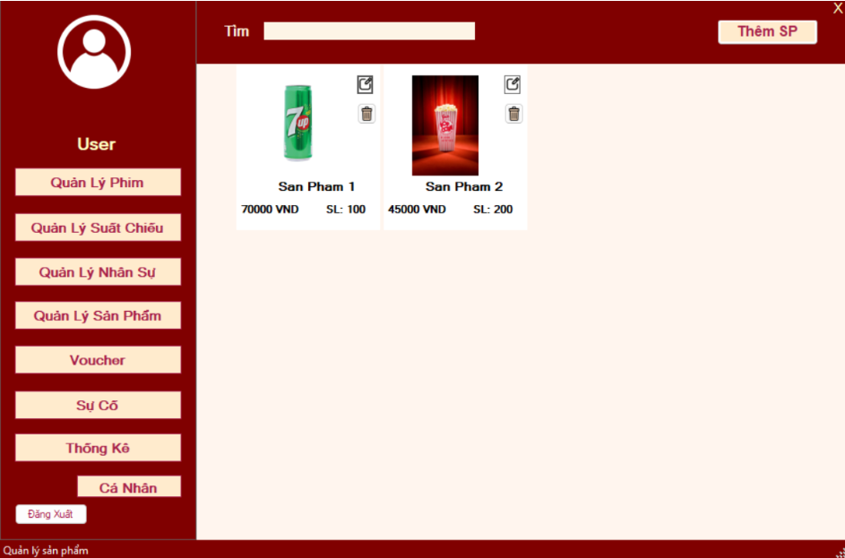
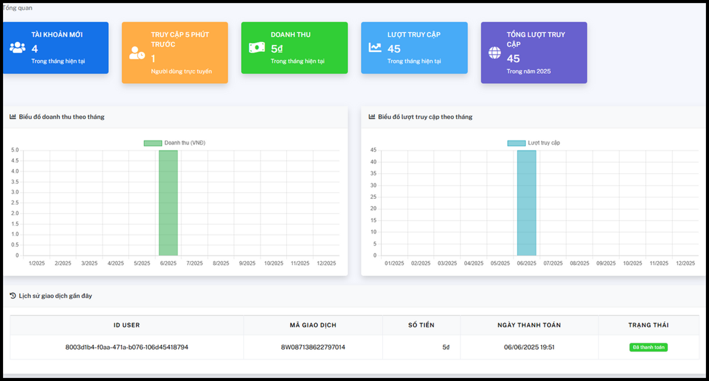

# About Me

{{< style "img { height: 1.25rem; }" >}}



> Tôi là Lê Ngọc Tuấn — sinh viên ngành Công nghệ Thông tin, đam mê Machine Learning, Data Science và phát triển phần mềm. Mục tiêu của tôi là áp dụng Python và kỹ thuật học máy để giải quyết các bài toán thực tế.

  
  

## Thông tin liên hệ

- :(fas fa-phone fa-fw): 0799471866
- :(far fa-envelope fa-fw): lengoctuanldk@gmail.com
- :(fas fa-map-marker-alt fa-fw): 220/21/5 Nguyễn Văn Khói, Quận ... , TP. HCM

## Học vấn

- Hutech University of Technology — Ngành: Công nghệ thông tin
- Thời gian: 2022 - 2026 · GPA: 3.0

## Chứng chỉ

  
  
  

## Về Tôi

Tôi là Lê Ngọc Tuấn, một sinh viên chuyên ngành Công nghệ Thông tin với niềm đam mê sâu sắc về Machine Learning, Data Science và phát triển phần mềm. Tôi tin rằng công nghệ không chỉ là công cụ — mà còn là phương tiện để giải quyết những vấn đề thực tế, tạo ra giá trị cho con người và doanh nghiệp. Với nền tảng vững chắc về lập trình Python và tư duy phân tích, tôi luôn hướng đến việc biến dữ liệu thành những giải pháp thông minh, có thể triển khai được.

Trong quá trình học tập và làm dự án, tôi chú trọng vào:
- Hiểu rõ lý thuyết nền tảng trước khi áp dụng framework;  
- Viết mã sạch, có kiểm thử và có khả năng tái sử dụng;  
- Đặt kết quả thực tế làm mục tiêu (accuracy, interpretability, hiệu năng và tích hợp hệ thống).

Tôi đã thực hiện một số dự án tiêu biểu liên quan đến phân loại cảm xúc từ đánh giá khách hàng và dự đoán hủy phòng khách sạn, nơi tôi đảm nhiệm thu thập, tiền xử lý dữ liệu, xây dựng mô hình và đánh giá kết quả. Những trải nghiệm này giúp tôi vừa nâng cao năng lực kỹ thuật, vừa rèn luyện khả năng làm việc nhóm, giao tiếp kỹ thuật với bên nghiệp vụ và triển khai mô hình vào môi trường thực tế.

Tôi luôn sẵn sàng hợp tác trong các dự án về phân tích dữ liệu, học máy và phát triển phần mềm. Nếu bạn có ý tưởng hoặc cơ hội thực tập/hợp tác, hãy liên hệ với tôi — tôi mong muốn học hỏi, đóng góp và cùng tạo ra sản phẩm có tác động.

## Các Dự Án Đã Tham Gia

### Quản Lý Rạp Chiếu Phim

- Học phần: Lập Trình Trên Môi Trường Window — Thời gian: Tháng 12/2025 - Tháng 1/2026

  
  
  
  
  
  

<a class="btn-link" href="https://github.com/pdtuan04/RapPhim" target="_blank" rel="noopener">Xem mã nguồn trên GitHub</a>

<lead >
- Vai trò: Thành viên nhóm, chịu trách nhiệm thiết kế giao diện và xử lý nghiệp vụ cho các form quản lý lịch chiếu và bán vé.
- Mô tả: Ứng dụng desktop giúp tự động hóa công việc vận hành tại rạp chiếu (đặt vé, quản lý lịch, báo cáo doanh thu), tối ưu quy trình phục vụ và theo dõi doanh thu theo ca.
- Những việc tôi thực hiện: thiết kế và lập trình UI cho form quản lý lịch chiếu/bán vé, triển khai logic xử lý nghiệp vụ, kết nối và đồng bộ hóa dữ liệu với cơ sở dữ liệu để đảm bảo lưu trữ/truy xuất chính xác.
- Công nghệ: C#, .NET WinForms, SQL (hệ quản trị cơ sở dữ liệu), các thư viện xử lý UI và thao tác dữ liệu.
- Điểm học phần: 4.0/4.0
- Github: mã nguồn dự án được lưu trữ trên GitHub (repo của nhóm).

### Hỗ Trợ Luyện Thi Bằng Lái Xe

- Học phần: Công Nghệ Phần Mềm — Thời gian: Tháng 5/2025 - Tháng 6/2025

  
  
  
  
  
  

<a class="btn-link" href="https://github.com/pdtuan04/DoAnCNPM" target="_blank" rel="noopener">Xem mã nguồn trên GitHub</a>

<lead >
- Vai trò: Thành viên nhóm phát triển backend và một số phần giao diện người dùng.
- Mô tả: Nền tảng học trực tuyến hỗ trợ ôn luyện lý thuyết lái xe với bộ câu hỏi mô phỏng, chế độ chấm điểm và theo dõi tiến độ học viên.
- Những việc tôi thực hiện: xây dựng các API/endpoint để xử lý câu hỏi và kết quả, tích hợp hệ thống với cơ sở dữ liệu, và phối hợp để đảm bảo front-end tương tác mượt mà với backend.
- Công nghệ: API backend, kết nối cơ sở dữ liệu SQL, RESTful endpoints và các phương thức xử lý dữ liệu đầu vào/đầu ra.
- Điểm học phần: 4.0/4.0
- Github: repository dự án chứa mã nguồn backend và hướng dẫn triển khai.

## Kỹ năng

- :(fas fa-code fa-fw): Ngôn ngữ lập trình: Python, C#, SQL
- :(fas fa-brain fa-fw): Machine Learning: scikit-learn, TensorFlow
- :(fas fa-database fa-fw): Cơ sở dữ liệu: MySQL, SQL Server
- :(fas fa-chart-line fa-fw): Visualization: Matplotlib, Power BI

---

  <a href="/cv.pdf" download style="display:inline-block;background:#007bff;color:#fff;padding:0.6rem 1rem;border-radius:6px;text-decoration:none;font-weight:600;">
    <i class="fas fa-download" style="margin-right:0.5rem;"></i> Tải CV của tôi tại đây (PDF)
  </a>
  

