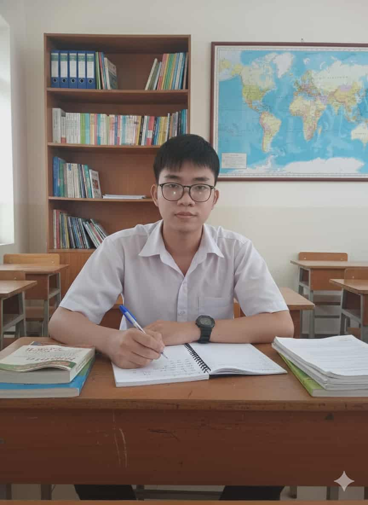
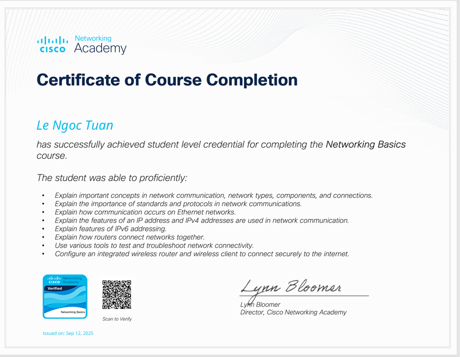

# Giới thiệu

{{< style "img { height: 1.25rem; }" >}}



> Tôi là Lê Ngọc Tuấn — sinh viên ngành Công nghệ Thông tin, đam mê Machine Learning, Data Science và phát triển phần mềm. Mục tiêu của tôi là áp dụng Python và kỹ thuật học máy để giải quyết các bài toán thực tế.

## Thông tin liên hệ

- :(fas fa-phone fa-fw): 0799471866
- :(far fa-envelope fa-fw): lengoctuanldk@gmail.com
- :(fas fa-map-marker-alt fa-fw): 220/21/5 Nguyễn Văn Khói, Quận ... , TP. HCM

  
  

## Học vấn

- Hutech University of Technology — Ngành: Công nghệ thông tin
- Thời gian: 2022 - 2026 · GPA: 3.0

## Chứng chỉ

  
  
  

## Về Tôi

Tôi là Lê Ngọc Tuấn, một sinh viên chuyên ngành Công nghệ Thông tin với niềm đam mê sâu sắc về Machine Learning, Data Science và phát triển phần mềm. Tôi tin rằng công nghệ không chỉ là công cụ — mà còn là phương tiện để giải quyết những vấn đề thực tế, tạo ra giá trị cho con người và doanh nghiệp. Với nền tảng vững chắc về lập trình Python và tư duy phân tích, tôi luôn hướng đến việc biến dữ liệu thành những giải pháp thông minh, có thể triển khai được.

Trong quá trình học tập và làm dự án, tôi chú trọng vào:
- Hiểu rõ lý thuyết nền tảng trước khi áp dụng framework;  
- Viết mã sạch, có kiểm thử và có khả năng tái sử dụng;  
- Đặt kết quả thực tế làm mục tiêu (accuracy, interpretability, hiệu năng và tích hợp hệ thống).

Tôi đã thực hiện một số dự án tiêu biểu liên quan đến phân loại cảm xúc từ đánh giá khách hàng và dự đoán hủy phòng khách sạn, nơi tôi đảm nhiệm thu thập, tiền xử lý dữ liệu, xây dựng mô hình và đánh giá kết quả. Những trải nghiệm này giúp tôi vừa nâng cao năng lực kỹ thuật, vừa rèn luyện khả năng làm việc nhóm, giao tiếp kỹ thuật với bên nghiệp vụ và triển khai mô hình vào môi trường thực tế.

Tôi luôn sẵn sàng hợp tác trong các dự án về phân tích dữ liệu, học máy và phát triển phần mềm. Nếu bạn có ý tưởng hoặc cơ hội thực tập/hợp tác, hãy liên hệ với tôi — tôi mong muốn học hỏi, đóng góp và cùng tạo ra sản phẩm có tác động.

## Kinh nghiệm nổi bật

- :(fas fa-check-circle fa-fw): Customer Review Sentiment Classification — Sử dụng Python, scikit-learn/TensorFlow để phân loại cảm xúc từ dữ liệu review.
- :(fas fa-check-circle fa-fw): Hotel Booking Cancellation Prediction — Xây dựng mô hình dự báo hủy phòng, tích hợp vào hệ thống quản lý.

## Kỹ năng

- :(fas fa-code fa-fw): Ngôn ngữ lập trình: Python, C#, SQL
- :(fas fa-brain fa-fw): Machine Learning: scikit-learn, TensorFlow
- :(fas fa-database fa-fw): Cơ sở dữ liệu: MySQL, SQL Server
- :(fas fa-chart-line fa-fw): Visualization: Matplotlib, Power BI

---

